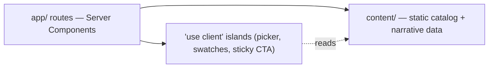
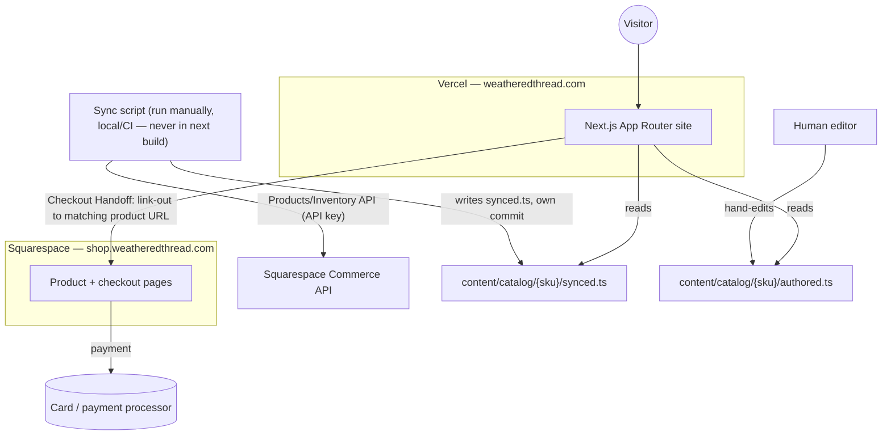

# Architecture Spine — Weathered Thread

## Design Paradigm

**Server-Components-first App Router.** React Server Components render by default for every route; `'use client'` is an explicit opt-in reserved for interactive picker state — motif selection, garment color/size selection, the live preview-image swap between synced/placeholder photos, and the sticky mobile Add-to-Bag bar (state ownership: AD-8). No global client-side store: interactivity is local component state, scoped to the Product and Collection Story surfaces `EXPERIENCE.md` defines.

Next.js 16's `cacheComponents` flag (unifies PPR/`use cache`/`dynamicIO`) stays **off** for v1: nothing on this site fetches per-request dynamic data — the catalog is build-time-synced static content (AD-2/AD-3) and there are no accounts (AD-5) — so default static rendering already covers it. Revisit only if a future feature needs per-request dynamic data mixed with a static shell.



## Invariants & Rules

### AD-1 — Squarespace is payment-only; no shared cart

- **Binds:** all
- **Prevents:** any attempt to call a Squarespace cart/checkout API from the custom site, or to hold cart/order state on this side of the boundary. No such API exists (web-confirmed). "No integration" here means specifically cart/session/checkout — AD-2's one-way catalog sync and AD-6's email send are separate, explicitly-scoped integrations, not exceptions to this AD.
- **Rule:** The custom site owns 100% of browsing, storytelling, and the garment×motif picker. The only integration point is outbound: a Checkout Handoff surface link-outs to the exact matching Squarespace product URL at `shop.weatheredthread.com`. Nothing reads or writes Squarespace cart/session state. The synced `url` field (from Squarespace's Products API — see AD-2) is the single source of truth for the handoff target; the sync script validates, at sync time, that its host is `shop.weatheredthread.com` and fails loudly if Squarespace returns a URL on any other host. Handoff components render this stored field as-is — they never construct or rewrite it.

### AD-2 — Squarespace is commerce source of truth; synced, not duplicated (web-confirmed)

- **Binds:** catalog data (content/)
- **Prevents:** price, inventory, SKU, or product name hand-maintained in two independently-updated places and drifting apart; synced and hand-authored data overwriting each other; a "runs during `next build`" reading that silently discards its own output on Vercel's ephemeral build filesystem; a stale sync snapshot regressing newer data via out-of-order commits; a partial/corrupt write on API failure.
- **Rule:** Each Squarespace SKU identifies exactly one `garment` (a color/size variant) — motif has no representation in Squarespace and is never part of the SKU (see Naming). `product` (garment × motif) is assembled entirely in-repo; it is never looked up from Squarespace by its own SKU.

  The sync script (`scripts/sync-squarespace.ts`) is run **manually, locally or in a one-off CI job — never from `next build` or any Vercel build/runtime step.** It fetches price, inventory, SKU, name, and product `url` from Squarespace's Products API + Inventory API (API-key auth, web-confirmed read access) and writes them to `content/catalog/{sku}/synced.ts` — a file it fully owns and overwrites on every run, all-or-nothing (on any fetch error it writes nothing rather than a partial file). It never writes to `content/catalog/{sku}/authored.ts`, which only a human edits (motif name, place/story copy, collection grouping); a per-SKU `index.ts` re-exports the merge of both. A sync run's output is always its own catalog-only commit — never bundled into a feature branch — and the script diffs against `main`'s current tip before writing, so a stale snapshot can't silently regress newer data. No runtime call to Squarespace from a visitor-facing request. Sync cadence is manual for v1 (see Deferred).

### AD-3 — Catalog is static content, not a database

- **Binds:** all data access
- **Prevents:** introducing a database, ORM, or CMS for a small, batch-updated catalog.
- **Rule:** All catalog and narrative content is TypeScript/JSON modules under `content/`, imported at build/request time. No server-side mutation endpoints for catalog data. (Current scale: ~10-12 garment SKUs; final garment×motif product count is still open, see Deferred — this AD holds regardless of that count landing somewhat higher.)

### AD-4 — Product images are repo-static

- **Binds:** all product/motif imagery
- **Prevents:** premature introduction of an external asset store (Blob/S3) before it's earned; mismatched image-field shapes between the entities that produce and consume them.
- **Rule:** Images live under `public/` (or content-colocated), referenced by path from `content/catalog/`. Closed set of image fields — no others added without a spine update: every `garment` carries one `swatchImage`; every `product` (garment×motif) carries one `previewImage` (the on-garment composite, placeholder-composited for now per the UX spine's photo strategy); every `motif` carries one `motifIcon`. Swapping placeholder composites for real photography is a file-replace, not an infra change.

### AD-5 — No accounts, no auth [ADOPTED]

- **Binds:** all
- **Prevents:** a builder introducing session/login infrastructure the product doesn't call for.
- **Rule:** The site has no user accounts, login, or personalization, per `EXPERIENCE.md`'s launch exclusions. No auth middleware, no session store.

### AD-6 — Email capture goes through Resend, server-side only

- **Binds:** all email-capture entry points
- **Prevents:** a client-exposed API key; a different email vendor introduced ad hoc later; duplicated/diverging validation across multiple signup entry points (homepage now, others later).
- **Rule:** Every email-capture entry point on the site posts to one Server Action, `subscribeEmail` (in `app/(site)/actions.ts`) — not a route handler, not a second implementation. Validation lives once, in this action. It calls Resend (Vercel Marketplace integration); the API key never reaches the client bundle.

### AD-7 — Domain split: registrar at Squarespace, app at Vercel, store at a subdomain

- **Binds:** DNS, deployment
- **Prevents:** the Squarespace checkout appearing on a visibly different domain at the one moment (Checkout Handoff) that most needs continuity.
- **Rule:** `weatheredthread.com` is registered/managed at Squarespace (registrar/DNS only — Squarespace hosts nothing at the root). DNS for the app domain points to Vercel. Squarespace's store/checkout pages live at a subdomain (e.g. `shop.weatheredthread.com`) of the same root domain, not Squarespace's own domain.

### AD-8 — One picker-state owner per Product surface

- **Binds:** Product surface client islands
- **Prevents:** `motif-tile`, `garment-swatch`, and the sticky Add-to-Bag bar each holding independent selection state and desyncing when composed together.
- **Rule:** Exactly one Client Component, `ProductPickerShell`, owns all picker `useState` (motif, color, size) per Product surface instance. Every island beneath it is presentational — it receives selection state and a setter via props/context, never instantiates its own.

## Consistency Conventions

| Concern | Convention |
| --- | --- |
| Naming (entities, files) | Catalog entities: `collection`, `motif` (repo-authored only — no Squarespace representation), `garment` (one Squarespace SKU — a color/size variant; the only entity Squarespace knows), `product` (one garment × motif pairing, assembled in-repo by cross-joining a collection's synced `garment`s against its authored `motif`s — the sellable-*to-the-customer* unit `EXPERIENCE.md` calls "Product," never itself a Squarespace SKU). File/route names match these nouns exactly; no synonyms (`item`, `design`, `variant`). |
| Data & formats | SKU is the join key between synced Squarespace data and repo-authored motif/story content — never re-derived or guessed; the `[sku]` route segment is byte-for-byte the stored SKU string, no case-folding or slugification. Price is stored as an integer in cents (never a formatted string or float); all display formatting goes through one shared `formatPrice()` util, never reimplemented per component. Image paths: see AD-4's closed field set. |
| State & cross-cutting | Picker selection state: owned per AD-8, never global, never persisted. Credentials are exactly two env vars, never renamed or duplicated under another name: `SQUARESPACE_API_KEY` (present only where the sync script is manually run — never in the Vercel production/preview build or runtime environment) and `RESEND_API_KEY` (Vercel production environment, server-only). Neither is ever referenced from a Client Component. |

## Stack

| Name | Version |
| --- | --- |
| Next.js (App Router) | 16.3.5 |
| React | 19.2.8 |
| TypeScript | 5.x |
| Tailwind CSS | 4.x |
| ESLint | 9.x |
| Hosting | Vercel, Pro plan |
| Email | Resend (Vercel Marketplace) |
| Commerce data source | Squarespace Products API + Inventory API (read, API-key auth) |

## Structural Seed



**Deployment & environments:** Production + automatic per-branch preview deployments on Vercel (default Vercel behavior, no extra setup). Domain registrar/DNS: Squarespace, for `weatheredthread.com`. `shop.weatheredthread.com` DNS → Squarespace's store; app domain DNS → Vercel. Environment variables (Squarespace API key, Resend API key) set in Vercel project settings, pulled locally via `vercel env pull`.

```text
weathered-thread/
  app/                    # routes — Server Components by default
    (site)/               # Home, Shop, Collections, About, Search
    (site)/actions.ts      # subscribeEmail Server Action (AD-6)
    product/[sku]/         # Product surface (garment x motif) — sku is byte-for-byte the stored SKU
    collections/[slug]/    # Collection Story
  components/
    islands/               # 'use client' — ProductPickerShell (owns state, AD-8), motif-tile, garment-swatch, sticky CTA (presentational)
  content/
    catalog/
      {sku}/
        synced.ts           # sync-script-owned only; full overwrite each run
        authored.ts         # human-edited only: motif name, story copy, grouping
        index.ts            # re-exports the merge of both
  scripts/
    sync-squarespace.ts    # manually run (local/CI); never invoked by `next build`
  public/                  # product/motif images (repo-static): swatchImage, previewImage, motifIcon
```

## Deferred

- **Sync automation.** Manually triggered for v1 (run script, commit, redeploy). Revisit as a Vercel Cron job or Squarespace-webhook-triggered revalidation once update cadence or team size justifies it.
- **Testing strategy.** No dedicated suite planned for v1 — the site is largely presentational. Revisit once picker/handoff logic grows enough branching to warrant unit tests.
- **Analytics/observability.** Not yet decided; addable later without an architectural fork.
- **Second-collection scalability.** The `collection → motifs, garments` data shape should accommodate a second town collection, but that's unproven until one is real.
- **External asset store (Blob/S3) for images.** Deferred until real photography needs non-developer updates without a code deploy (see AD-4).
- **Garment-to-motif assignment, final pricing, final SKUs, real on-garment photography.** Business/content decisions carried from the UX spine — not architecture's to resolve.
- **Squarespace plan tier for Inventory/Orders/Transactions API access.** AD-2's sync depends on these; a reviewer flagged they may require Commerce Plus/Advanced (unconfirmed on Commerce Basic). User believes their plan already covers it; verification tabled rather than resolved — confirm before building the sync script.
